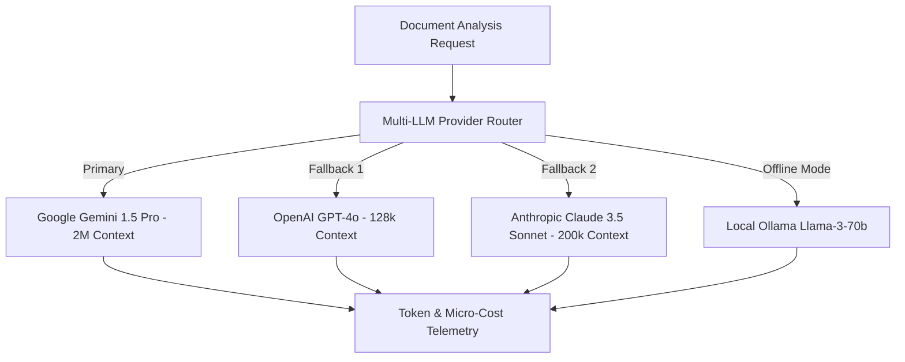

# AI Formatting Copilot & Intelligence Engine

The **AI Formatting Copilot & Intelligence Engine** provides non-destructive AI publication insights, multi-LLM router failover (Gemini 1.5 Pro, GPT-4o, Claude 3.5 Sonnet, Local Ollama), automatic document structure classification, low-confidence region detection, editorial quality scoring, and interactive AI assistance across DocForge.

---

## 1. Multi-LLM Provider Router Architecture

---

## 2. Non-Destructive Formatting Copilot Workflow

1. **Document Inspection**: The AI engine inspects the Internal Document Model (IFDM) AST to detect typography inconsistencies, unstyled headings, missing drop caps, or improper paragraph margins.
2. **Recommendation Generation**: Generates non-destructive `AISuggestion` objects containing side-by-side diff previews and confidence scores (e.g. 95% Match).
3. **Human-in-the-Loop Approval**: Recommendations are queued in the AI Copilot UI for manual Accept / Reject action—**never auto-applied without user consent**.

---

## 3. Low-Confidence Region Inspection

Elements where parsing or layout algorithms scored `< 80%` confidence are flagged as `low_confidence_regions`:
- Ambiguous paragraph headings missing heading tags.
- Complex merged cell layouts in tables.
- Corrupted math formulas or missing figure captions.

---

## 4. REST API Reference

| Method | Route | Description |
| :--- | :--- | :--- |
| `POST` | `/api/v1/documents/{id}/ai/analyze` | Trigger AI document structure analysis & copilot suggestion generation |
| `GET` | `/api/v1/documents/{id}/ai/insights` | Retrieve document structure tree, domain classification, and quality scores |
| `GET` | `/api/v1/documents/{id}/ai/suggestions` | Fetch pending non-destructive AI formatting recommendations |
| `POST` | `/api/v1/ai/suggestions/{id}/accept` | Accept AI formatting recommendation and apply style override |
| `POST` | `/api/v1/ai/suggestions/{id}/reject` | Dismiss AI formatting recommendation |
| `GET` | `/api/v1/ai/usage/{document_id}` | Retrieve prompt/completion token usage and cost micro-accounting |
| `GET` | `/api/v1/ai/providers/list` | List active LLM providers, context windows, and fallback order |
