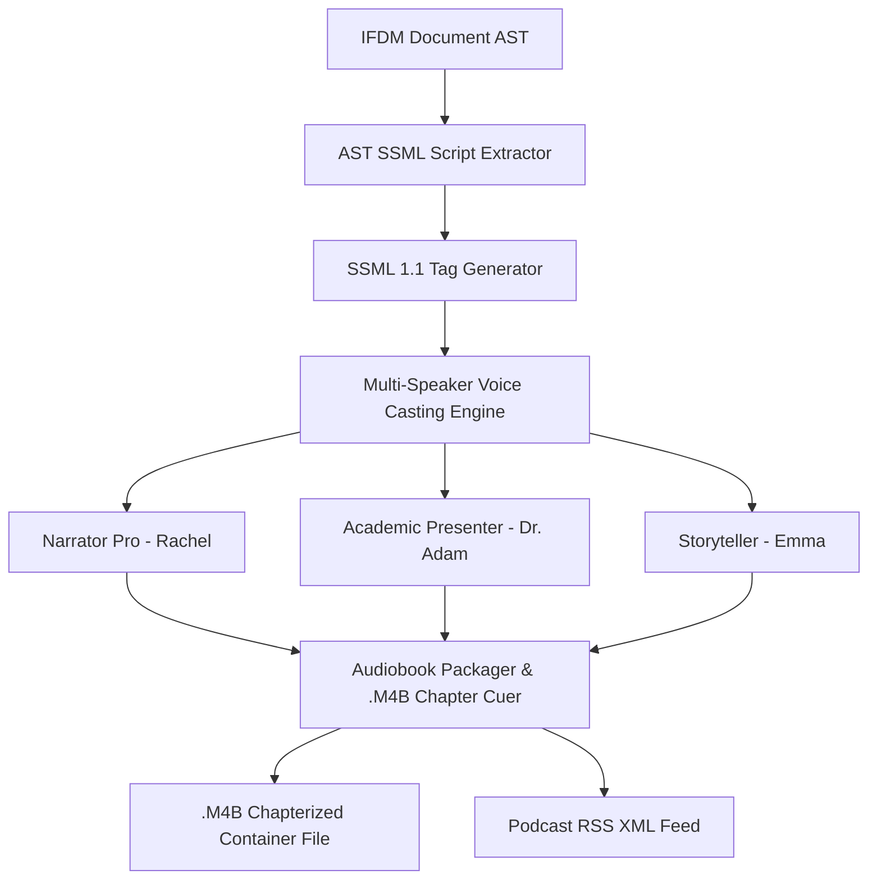

# Interactive AudioBook, Podcast & Voice Synthesizer Studio

The **Interactive AudioBook, Podcast & Voice Synthesizer Studio** enables publishers, authors, and accessibility managers to generate chapterized audiobooks (`.m4b`), narrator podcasts, and multi-speaker voice publications directly from their formatted document AST (IFDM).

---

## 1. AST Narration Scripting Architecture

---

## 2. SSML Break & Pause Rules

- **Chapter Titles**: `<break time="800ms"/>` inserted before chapter headings.
- **Section Headings**: `<break time="600ms"/>` inserted before Heading 2 / Heading 3 nodes.
- **Paragraph Breaks**: `<break time="350ms"/>` between paragraph blocks.
- **Unread Elements**: Table border markup, page numbers, and running headers automatically skipped.

---

## 3. REST API Reference

| Method | Route | Description |
| :--- | :--- | :--- |
| `POST` | `/api/v1/audio/{doc_id}/synthesize` | Trigger AI voice synthesis & audiobook generation |
| `GET` | `/api/v1/audio/{doc_id}/job` | Retrieve synthesis status, chapter tracks, and player URL |
| `GET` | `/api/v1/audio/voices` | List available synthetic AI narrator voices |
