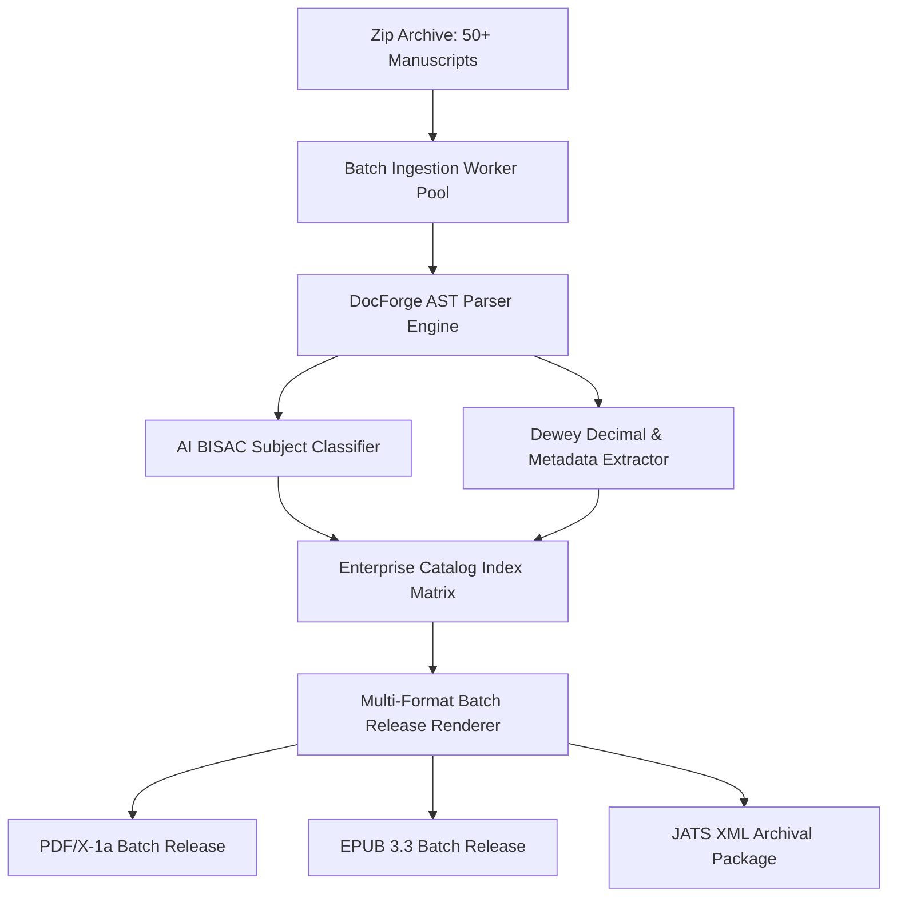

# Enterprise Batch Processing, Ingestion Pipeline & Auto-Cataloging Engine

The **Enterprise Batch Processing, Ingestion Pipeline & Auto-Cataloging Engine** enables enterprise publishers, institutional repositories, and academic presses to perform bulk manuscript ingestion (50+ files per zip archive), automated BISAC classification, Dewey Decimal indexing, and batch multi-format release rendering.

---

## 1. Bulk Ingestion Architecture

---

## 2. REST API Reference

| Method | Route | Description |
| :--- | :--- | :--- |
| `POST` | `/api/v1/batch/ingest` | Trigger bulk manuscript archive ingestion |
| `GET` | `/api/v1/batch/jobs/{job_id}` | Retrieve batch job progress percentage, status, and ingested files |
| `GET` | `/api/v1/batch/catalog` | Full-text query and BISAC subject category filter across enterprise catalog |
