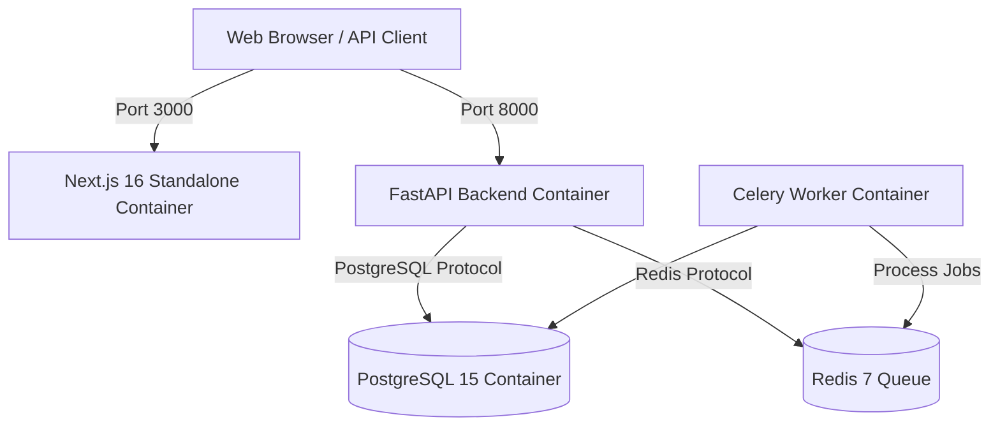

# Production Deployment & DevOps Infrastructure Guide

This guide provides instructions for containerizing, deploying, and operating **DocForge / BookForge** in production environments.

---

## 1. System Requirements

- **Docker**: Version 24.0+
- **Docker Compose**: Version 2.20+
- **Database**: PostgreSQL 15+ (PostGIS extension optional)
- **Queue Store**: Redis 7+
- **Node.js**: Node 20 LTS (for local frontend build)
- **Python**: Python 3.11 (for local backend execution)

---

## 2. Multi-Container Production Architecture



---

## 3. Quick Start Deployment Commands

### Local Development Server
```powershell
make dev-backend     # Starts FastAPI backend at http://localhost:8000
make dev-frontend    # Starts Next.js frontend at http://localhost:3000
make worker          # Starts Celery background task worker
```

### Multi-Container Production Launch
```powershell
make docker-up       # Builds Docker images and launches production stack
make docker-down     # Stops production stack
```

### Integration Test Suite Execution
```powershell
make test            # Runs backend Pytest suite & frontend TypeScript check
```

---

## 4. Environment Configuration

Copy `.env.example` to `.env` in `backend` and `frontend` directories:

| Variable | Default Value | Description |
| :--- | :--- | :--- |
| `DATABASE_URL` | `postgresql://docforge_user:docforge_password@db:5432/docforge_db` | PostgreSQL connection string |
| `REDIS_URL` | `redis://redis:6379/0` | Redis task queue broker URL |
| `SECRET_KEY` | `production_secret_key_here` | JWT 256-bit signing key |
| `NEXT_PUBLIC_API_URL` | `http://localhost:8000/api/v1` | Public API endpoint for frontend client |
