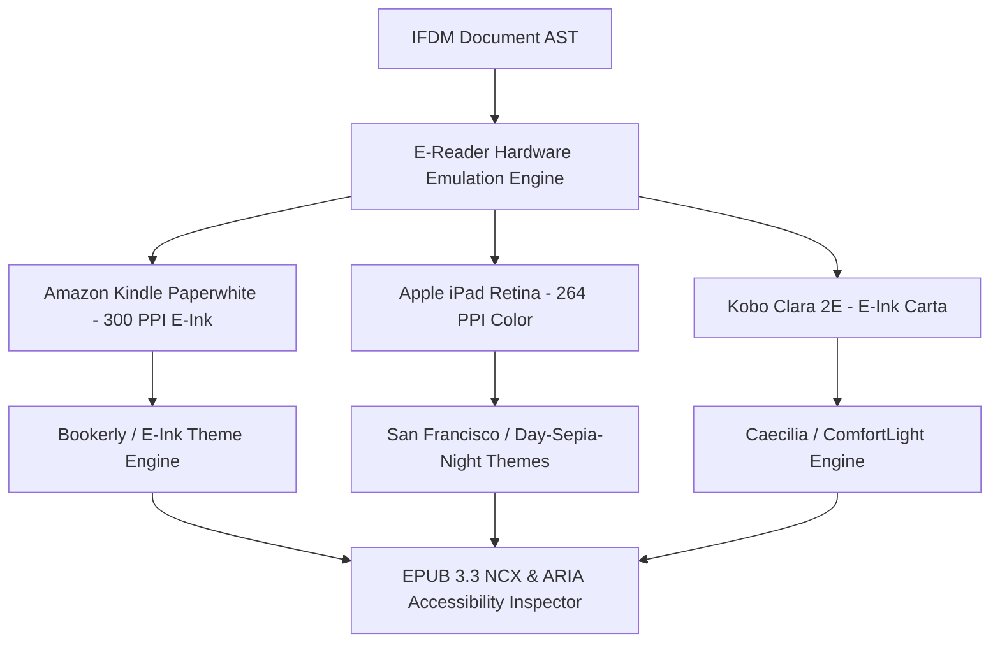

# EPUB3 & Kindle E-Reader Inspector Studio

The **EPUB3 & Kindle E-Reader Inspector Studio** enables publishers, authors, and e-book production teams to preview, inspect, validate, and format digital publications across physical e-reader hardware (Amazon Kindle Paperwhite, Apple Books iPad Retina, Kobo Clara 2E).

---

## 1. Multi-Device Hardware Emulation Architecture

---

## 2. Supported E-Reader Devices & Formats

| Device Target | Display Type | Resolution & PPI | Supported Layout Modes |
| :--- | :--- | :--- | :--- |
| **Amazon Kindle Paperwhite** | 6.8" E-Ink Carta 1200 | 1440 x 1080 (300 PPI) | Reflowable (KFX / MOBI) |
| **Apple iPad Pro 11"** | 11" Liquid Retina IPS | 2388 x 1668 (264 PPI) | Reflowable & Fixed Layout (EPUB 3.3) |
| **Kobo Clara 2E** | 6.0" E-Ink Monochrome | 1448 x 1072 (300 PPI) | Reflowable (KEPUB / EPUB) |
| **Google Pixel 8 Pro** | 6.7" OLED Display | 2992 x 1344 (489 PPI) | Reflowable & Readium EPUB |

---

## 3. REST API Reference

| Method | Route | Description |
| :--- | :--- | :--- |
| `GET` | `/api/v1/ereader/{doc_id}/preview` | Retrieve e-reader display preview payload and NCX table of contents |
| `POST` | `/api/v1/ereader/{doc_id}/config` | Save e-reader display preferences (font, theme, device target) |
| `GET` | `/api/v1/ereader/devices` | List supported physical e-reader hardware targets |
