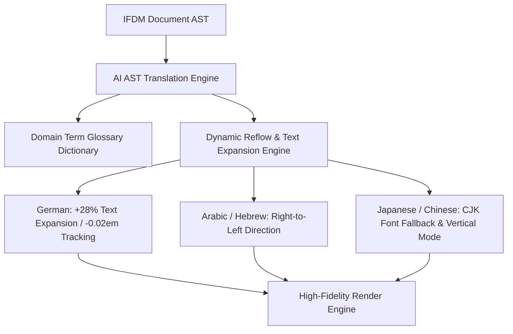

# AI Multi-Lingual Localization & Global Rights Engine

The **AI Multi-Lingual Localization & Global Rights Engine** empowers publishers, global rights managers, and international editors to localize manuscripts into over 50 languages with layout-aware translation, dynamic text expansion reflow, RTL/CJK typography rules, and international territory rights tracking.

---

## 1. Layout-Aware Translation Architecture

---

## 2. Text Expansion & Reflow Benchmark Rules

| Language | Code | Text Length Variance | Font Tracking Adjustment | Reading Flow |
| :--- | :--- | :--- | :--- | :--- |
| **English (Source)** | `en` | 1.00 (Baseline) | Standard | Left-to-Right |
| **German** | `de` | +28% Expansion | `-0.02 em` | Left-to-Right |
| **French** | `fr` | +18% Expansion | `-0.01 em` | Left-to-Right |
| **Spanish** | `es` | +15% Expansion | `-0.01 em` | Left-to-Right |
| **Japanese** | `ja` | -15% Contraction | Standard + CJK Fallback | LTR / Vertical |
| **Arabic** | `ar` | +12% Expansion | Standard | Right-to-Left (RTL) |

---

## 3. REST API Reference

| Method | Route | Description |
| :--- | :--- | :--- |
| `POST` | `/api/v1/localization/{doc_id}/translate` | Trigger AI multi-lingual translation job |
| `GET` | `/api/v1/localization/{doc_id}/translations` | Retrieve translation variants & quality metrics |
| `GET` | `/api/v1/localization/glossary` | Manage translation glossary term dictionaries |
| `GET` | `/api/v1/localization/rights/{project_id}` | List territory rights & language ISBN assignments |
| `POST` | `/api/v1/localization/rights/{project_id}` | Add international territory licensing agreement |
