# Overview Telemetry Command Center & Live Operations Studio

The **Overview Telemetry Command Center & Live Operations Studio** is the central executive monitoring dashboard of DocForge. It unifies real-time status telemetry across all 13 core engines, active Celery background workers, system processing latency metrics, and interactive quick-action launchers.

---

## 1. 13-Engine Microservice Monitoring Architecture

```mermaid
graph TD
    Dashboard[Overview Telemetry Command Center] --> Engine1[Parser & Analysis Engine]
    Dashboard --> Engine2[Rule-Based Formatting Engine]
    Dashboard --> Engine3[Multi-Format Transformation Engine]
    Dashboard --> Engine4[Advanced Layout Engine & Paginator]
    Dashboard --> Engine5[High-Fidelity Rendering Engine]
    Dashboard --> Engine6[Peer Review & Proofing Engine]
    Dashboard --> Engine7[Workflow Orchestration Engine]
    Dashboard --> Engine8[Enterprise Visual Editor Studio]
    Dashboard --> Engine9[Multi-Format Export & Release Engine]
    Dashboard --> Engine10[Publisher Blueprint Studio]
    Dashboard --> Engine11[AI Copilot & Intelligence Engine]
    Dashboard --> Engine12[Project & Catalog Management Hub]
    Dashboard --> Engine13[Audit, Security & SOC2 Studio]
```

---

## 2. Platform Telemetry Metrics & Speed Benchmarks

- **Layout Rule Compliance**: `99.2%` accuracy with 0 publisher rule violations.
- **Average Rendering Latency**: `42 ms` per 100 pages (GPU accelerated).
- **Worker Queues**: Real-time Celery worker telemetry monitoring.

---

## 3. Executive Quick-Action Launchers

- **Visual Editor Studio**: Launch `/dashboard/editor` for desktop-class publishing editing.
- **Export & Releases**: Launch `/dashboard/export` for PDF/X, EPUB, JATS XML rendering.
- **AI Copilot Studio**: Launch `/dashboard/ai` for non-destructive formatting recommendations.
- **Workflow Pipeline Builder**: Launch `/dashboard/workflows` for DAG pipeline management.
- **Publisher Blueprint Studio**: Launch `/dashboard/templates` for `.blueprint.json` specifications.
