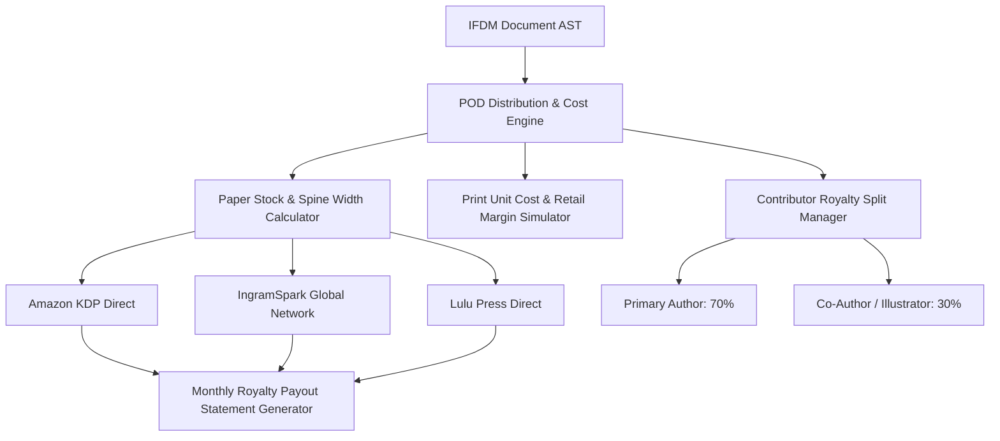

# Print-on-Demand (POD) Distribution & Royalty Analytics Engine

The **Print-on-Demand (POD) Distribution & Royalty Analytics Engine** enables publishers, independent authors, and digital imprints to connect with global POD printing networks (Amazon KDP, IngramSpark, Lulu Press, Barnes & Noble Press), calculate exact spine width & cover template dimensions, and automate contributor royalty split payouts.

---

## 1. POD Distribution & Royalty Architecture

---

## 2. Paper Stock PPI & Spine Formulas

| Paper Stock Weight | Pages Per Inch (PPI) | Caliper Thickness / Page |
| :--- | :--- | :--- |
| **50lb White** | 500 PPI | `0.00200 in (0.0508 mm)` |
| **60lb Cream** | 444 PPI | `0.00225 in (0.0571 mm)` |
| **70lb Premium Color** | 380 PPI | `0.00263 in (0.0668 mm)` |

- **Spine Width Formula**: `Spine Inches = Page Count / PPI`
- **Total Cover Width Formula**: `Width = (Trim Width * 2) + Spine Inches + 0.25in Bleed`

---

## 3. REST API Reference

| Method | Route | Description |
| :--- | :--- | :--- |
| `POST` | `/api/v1/pod/{doc_id}/spine-calculator` | Compute exact spine width, cover template dimensions, and unit print costs |
| `GET` | `/api/v1/pod/{project_id}/royalties` | Retrieve channel sales, unit gross revenue, and contributor royalty split payouts |
