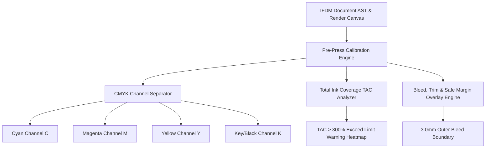

# Pre-Press Color Proofing, Spot Color & Bleed Calibration Studio

The **Pre-Press Color Proofing, Spot Color & Bleed Calibration Studio** provides press operators, layout artists, and production managers with professional press-readiness inspection tools: CMYK soft-proofing, Total Ink Coverage (TAC) heatmap warnings, Pantone spot color mapping, and dynamic 3mm bleed/trim overlays.

---

## 1. CMYK Separation & TAC Inspection Architecture

---

## 2. Press Profile Standards

| Profile ID | Profile Name | Region | Max TAC Limit |
| :--- | :--- | :--- | :--- |
| `Fogra39_Coated` | Coated FOGRA39 (ISO 12647-2) | European Commercial Press | 330% Total Ink |
| `SWOP_2006_Web` | SWOP 2006 Coated #3 (Web Press) | North American Web Offset | 300% Total Ink |
| `GRACol_2013` | GRACoL 2013 Coated (CRPC6) | Global Sheet-Fed Press | 320% Total Ink |

---

## 3. REST API Reference

| Method | Route | Description |
| :--- | :--- | :--- |
| `GET` | `/api/v1/prepress/{doc_id}/analysis` | Retrieve ink coverage warnings, TAC heatmap, and CMYK density |
| `POST` | `/api/v1/prepress/{doc_id}/config` | Save ICC profile, bleed margin size (3mm), and spot color mappings |
| `GET` | `/api/v1/prepress/profiles` | List supported commercial press ICC color profiles |
