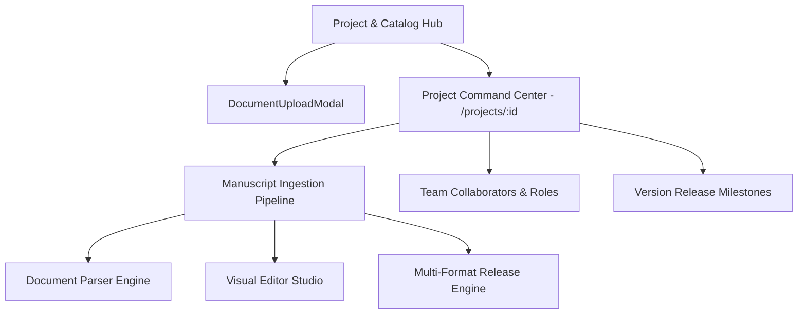

# Enterprise Project & Catalog Management Hub

The **Enterprise Project & Catalog Management Hub** acts as the central command center of DocForge. It coordinates multi-document publishing projects, catalog organization structure, manuscript file ingestion (DOCX, PDF, EPUB, Markdown), team collaborator RBAC roles, version milestone tagging, and real-time processing telemetry.

---

## 1. Publishing Project Architecture

---

## 2. Collaborator Team RBAC Roles

| Role Tag | Title | Permissions |
| :--- | :--- | :--- |
| `OWNER` | Project Owner | Full administrative control, member invitations, project deletion |
| `MANAGING_EDITOR` | Managing Editor | Workflow approvals, milestone tagging, peer review assignments |
| `LAYOUT_ARCHITECT` | Layout Architect | Blueprint selection, visual editor layout tweaks, template overrides |
| `REVIEWER` | Peer Reviewer | Proofing corrections, inline comments, suggestion acceptance |
| `VIEWER` | Read-Only Viewer | Read-only inspection and export file download |

---

## 3. REST API Reference

| Method | Route | Description |
| :--- | :--- | :--- |
| `GET` | `/api/v1/projects` | List projects with search, category filtering, and pagination |
| `POST` | `/api/v1/projects` | Create new publishing project workspace |
| `GET` | `/api/v1/projects/{id}` | Retrieve project details, manuscript list, and completion telemetry |
| `PATCH` | `/api/v1/projects/{id}` | Update project metadata (title, category, template) |
| `POST` | `/api/v1/projects/{id}/favorite` | Toggle project favorite status |
| `DELETE` | `/api/v1/projects/{id}` | Soft delete or archive project |
