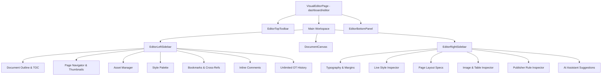

# DocForge Enterprise Visual Editor & Live Formatting Workspace

The **Enterprise Visual Editor** is the desktop-grade publishing workspace of DocForge. It operates directly on Internal Document Models (IFDM/LDM) as granular, replayable operational transforms (OT).

---

## 1. Editor Architecture & Component Tree

---

## 2. Live Style Inspection Pipeline

The **Live Style Inspector** breaks down element typography into 5 resolution layers:

1. **Applied Direct Style**: Local inline styling rules (e.g. `font_weight: bold`).
2. **Computed Style**: Net computed CSS properties.
3. **Inherited Style**: Properties inherited from parent `<section-body>` or block container.
4. **Blueprint Template Style**: Blueprint specifications defined by the publisher template.
5. **Rule Overrides**: Flags any property deviations from publisher style rules.

---

## 3. Keyboard Shortcuts Reference

| Shortcut | Action |
| :--- | :--- |
| `Ctrl + S` | Save document & log OT operation revision |
| `Ctrl + Z` | Undo last operation (inverse OT execution) |
| `Ctrl + Y` | Redo last undone operation |
| `Ctrl + B` | Toggle Bold text formatting |
| `Ctrl + I` | Toggle Italic text formatting |
| `Ctrl + U` | Toggle Underline text formatting |
| `Ctrl + F` | Open Document Search & Replace |
| `Ctrl + Shift + P` | Open Page Navigator & Go To Page |

---

## 4. REST API Endpoint Reference

| Method | Route | Description |
| :--- | :--- | :--- |
| `GET` | `/api/v1/editor/{document_id}` | Load document IFDM AST, active sessions, style palette, and initial snapshot |
| `POST` | `/api/v1/editor/save/{document_id}` | Persist operation OT payload and document state |
| `POST` | `/api/v1/editor/undo/{document_id}` | Execute inverse operation rollback |
| `POST` | `/api/v1/editor/redo/{document_id}` | Replay undone operation |
| `GET` | `/api/v1/editor/styles/inspect` | Inspect element's Applied, Computed, Inherited, and Blueprint styles |
| `POST` | `/api/v1/editor/format/{document_id}` | Apply inline, paragraph, table, or page layout formatting |
| `POST` | `/api/v1/editor/snapshot/{document_id}` | Capture version snapshot milestone |
| `GET` | `/api/v1/editor/history/{document_id}` | Retrieve unlimited operation audit trail |

---

## 5. Developer Guide

### Adding Custom Editor Formatting Tools

1. Update `EditorTopToolbar.tsx` to add toolbar icon & callback `onFormat("customTool", value)`.
2. Add handling in `EditorService.apply_operation` (`backend/app/services/editor_service.py`) for the operation type payload.
3. Update `EditorHistory` audit log format.
