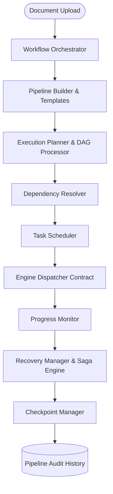
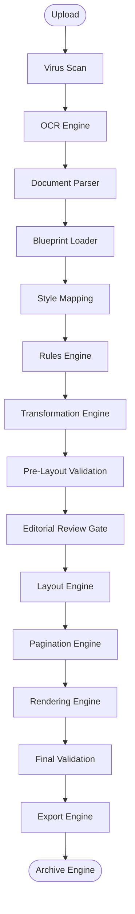
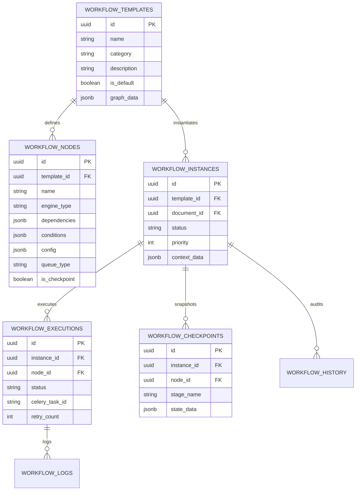

# DocForge / BookForge Workflow Orchestration Engine

The **Workflow Orchestration Engine** serves as the central brain of DocForge. It coordinates every stage of the document publishing pipeline across all specialized engines without tight coupling.

---

## 1. Architecture & Core Principles

Every document processing job passes through the Workflow Orchestration Engine.



### Key Principles
1. **Loose Coupling**: Engines never invoke each other directly. All communications are mediated by the Workflow Orchestrator via event contracts.
2. **DAG Dependency Resolution**: Kahn's algorithm validates graph topology, eliminates circular dependencies, and identifies ready parallel stages.
3. **Saga Pattern Compensation**: Automatic retry backoffs, checkpoint state restoration, and inverse compensations on stage failures.
4. **Multi-Queue Compute Manager**: Allocates jobs to specialized queues (`priority`, `publisher`, `gpu`, `cpu`, `worker`, `large_doc`) based on resource requirements.

---

## 2. Default 16-Stage Publishing Pipeline



---

## 3. Entity-Relationship (ER) Diagram



---

## 4. REST API Endpoint Reference

| Method | Route | Description |
| :--- | :--- | :--- |
| `POST` | `/api/v1/workflow/start` | Launch a workflow pipeline for a document |
| `GET` | `/api/v1/workflow/{id}` | Fetch instance state, topology graph, and executions |
| `GET` | `/api/v1/workflow/{id}/status` | Quick status check & active stage query |
| `POST` | `/api/v1/workflow/{id}/pause` | Pause running workflow execution |
| `POST` | `/api/v1/workflow/{id}/resume` | Resume paused workflow execution |
| `POST` | `/api/v1/workflow/{id}/cancel` | Cancel active workflow execution |
| `POST` | `/api/v1/workflow/{id}/restart` | Restart workflow from initial stage |
| `GET` | `/api/v1/workflow/templates` | List built-in and custom templates |
| `POST` | `/api/v1/workflow/templates` | Save a new custom workflow template |
| `POST` | `/api/v1/workflow/templates/validate` | Validate DAG topology (detect cycles) |
| `GET` | `/api/v1/workflow/{id}/checkpoints` | List saved state checkpoints |
| `POST` | `/api/v1/workflow/{id}/restore` | Restore state snapshot and restart pipeline |
| `GET` | `/api/v1/workflow/{id}/history` | Fetch complete audit event history |
| `GET` | `/api/v1/workflow/metrics/dashboard` | Retrieve worker queue telemetry and throughput |

---

## 5. Developer & Integration Guide

### Registering a New Engine Node

1. Define the engine type key in `EngineDispatcher` (`backend/app/core/orchestrator/dispatcher.py`).
2. Add execution contract handler method:
```python
def _execute_my_custom_engine(self, config: Dict[str, Any], context: Dict[str, Any]) -> Dict[str, Any]:
    # Custom domain logic here
    return {"custom_stage_result": True}
```
3. Register the engine type in `AVAILABLE_ENGINE_TYPES` in `PipelineDesigner.tsx`.
